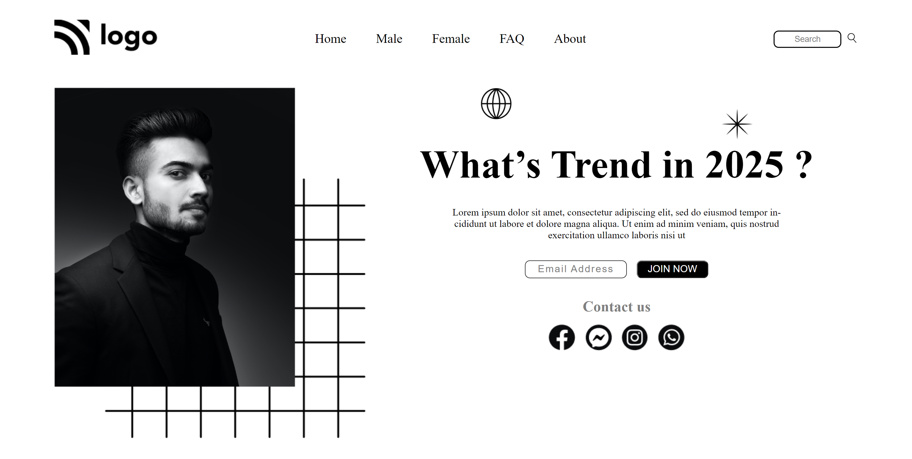

##🔗Project 1 Link
[https://vishal-product-home-page-html-css.netlify.app/](https://vishal-product-home-page-html-css.netlify.app/)

<br>

##⭐Project-1: Street Style Landing Page ⭐

This is the assignment given in the **"JavaScript Full Stack Web Developer Bootcamp"** by **iNeuron** *&* This Assignment was done using **HTML5 & CSS3.**

<br>

###📌 Tech Stack

[](https://github.com/pk170970)&nbsp; [](https://github.com/pk170970)&nbsp;

<br>

###📌 Overview



###📌 What I Learn

```
👉 How to Structure **HTML** and **CSS**
👉 Flexbox & Properties
👉 Positioning in CSS
👉 CSS Selectors
👉 Various properties like color, background-color, width, height and much more.
👉 How to apply Custom Fonts
👉 Margin and Padding
```

###Time Taken to Complete this Project:- 3 Hours

###📬 Connect With Me

- **LinkedIn** - [Vishal Rikhi](https://www.linkedin.com/in/vishal-rikhi/)

###📌 Acknowledgement

- **Course Instructor** - [Hitesh Choudhary](https://www.linkedin.com/in/hiteshchoudhary/)


